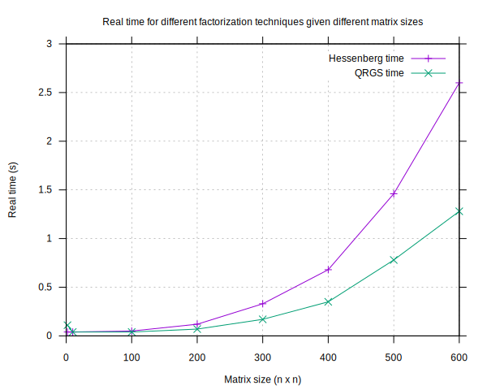

# Exam project 14 - Hessenberg factorization

## Main exercise

> Implement Hessenberg factorization of a square matrix using Jacobi transformations. 
Remember to accumulate the total transformation matrix. When multiplying with the J-matrices you should use your Jtimes and timesJ routines from Jacobi-eigenvalue homework that take O(n) operations.

Hessenberg factorization of a square matrix was implemented using Jacobi rotations in the file [Hessenberg.cs](src/Hessenberg.cs).
The implementation was tested on random 5x5, and 10x10 matrices and random symmetric 5x5 matrices. One of the tests can be found in [Out.txt](data/Out.txt).

The implementation of the Jacobi rotations can be found in in [Jacobi.cs](../lib/Jacobi.cs).

## Extra exercises

### Which factorization is faster, Hessenberg or QR.

> Find out (by time measurements) which factorization is faster, Hessenberg or QR.

The time taken to do Hessenberg factorization and QR factorization was investigated by plotting the real time for the factorizations for different matrix sizes in [TimePlot.svg](plots/TimePlot.svg).
Using my implementations of Gram-Schmidt orthoginalization and Hessenberg factorization the scaling is worse for the Hessenberg method.

